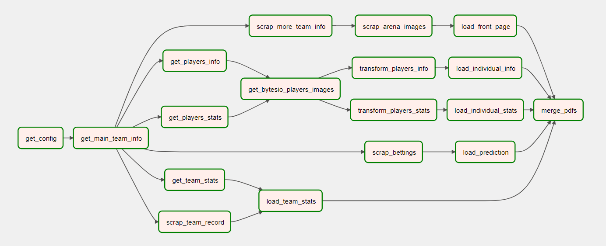

[](https://www.python.org/)
[](https://airflow.apache.org/)
[](https://www.docker.com/)
[](https://pypi.org/project/fpdf2/)

<div align="left">
  
</div>

# NBA Statistic Analisys
### Data Adquisition ETL using APIs and Web Scraping

## Table of Contents

- [About this Project](#about-this-project)
    - [Airflow DAG](#airflow-dag)

- [Getting Started](#getting-started)
    - [Prerequisites](#prerequisites)
    - [Installation](#installation)
- [Usage](#usage)
- [Contact](#contact)

## About This Project

This project is a `data adquisition ETL` which extracts data both from [API](api-url) and Web Scraping.  
The data aquired is used to make a statistic analisys of the NBA and a prediction for the next game of the given team.  
<br>
A pdf report is generated with the results every day at `15:00 UTC`.  

### Airflow DAG



## Getting Started

To get a local copy up and running follow these simple example steps.

### Prerequisites

- Docker and Docker Compose
- Git

### Installation

1. Clone the repo

```sh
git clone https://github.com/gomicoder17/NBA.git
```

2. Make sure that docker is running. If you are in Windows, run [Docker Desktop](https://www.docker.com/products/docker-desktop)

3. Build docker container (It may take up to 4 minutes)

```sh
docker-compose build [OPTIONAL --no-cache]
```

## Usage

1. Add your API key, season and team to the [config.json](config.json) file

- Example:

```json
{
    "api_key": "YOUR_API_KEY",
    "season": "2023",
    "team": "MIN"
}
```

2. If you want to run `one dag for each team` once, go to [dags/nba-dags.py](dags/nba-dags.py) and set 
```python
run_all = True
```

3. Run the docker container (It make take up to one minute to load the GUI)

```sh
docker-compose up [OPTIONAL: -d]
```

3. Go to [localhost:8080](http://localhost:8080) and login with `admin` and `admin` to see the DAG

## Contact

- [Sergio Herreros Perez][email]

[api-url]: https://sportsdata.io/developers/api-documentation/nba
[email]: mailto:gomimaster1@gmail.com